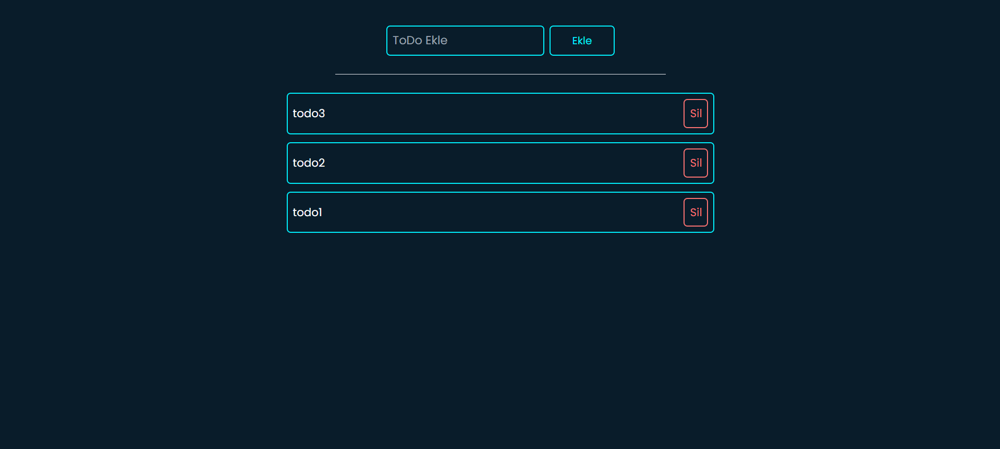
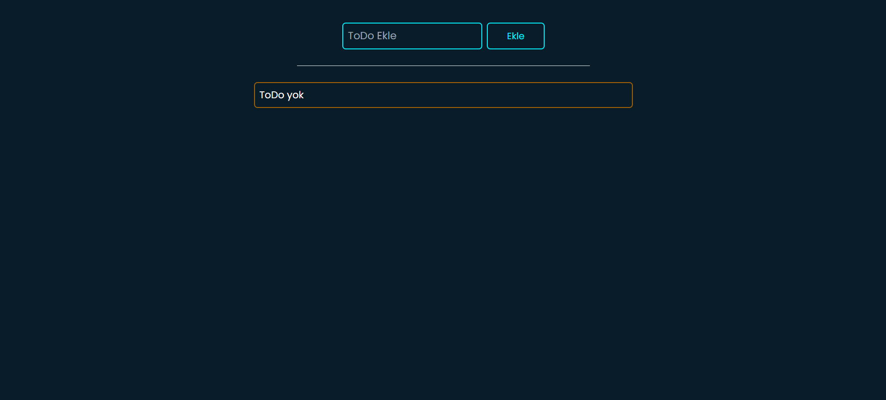
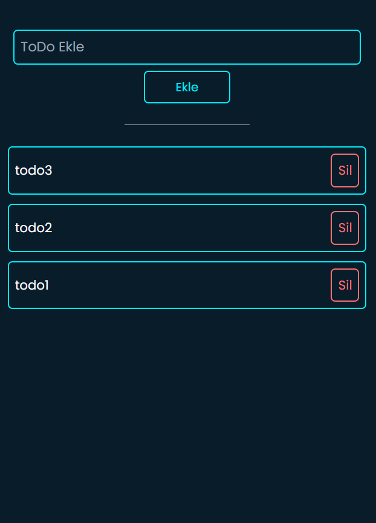
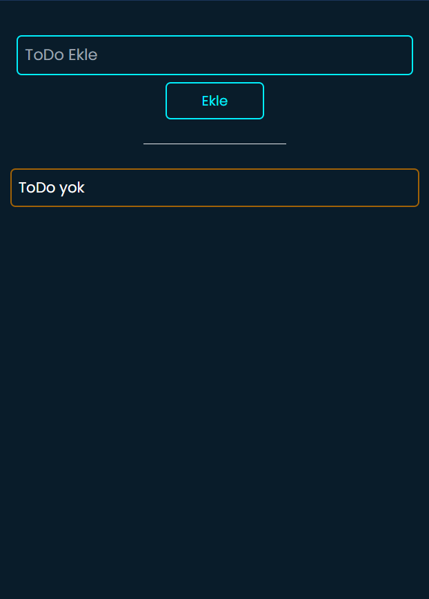

## 📃 `To Do List`

<br>

- URL

```url
https://todo-list-furkankayam.netlify.app/
```

<br>

- ✅ Responsive To Do List App

<br>

- 💻 Desktop

<div align="center">

</div>
<div align="center">

</div>

<br>

- 📱 Mobile



<br>
<br>

Used Technologies in The Project:

[](https://react.dev/)
[](https://react-icons.github.io/react-icons/)
[](https://react-icons.github.io/react-icons/)

<br>

### Installation

```bash
git clone https://github.com/furkankayam/todo-list.git
```

<br>

### Usage

```bash
npm run dev
```

<br>

### URL

```bash
http://localhost
```

<br>

<br>

# License

This project is licensed under the MIT License. See the [LICENSE](./LICENSE) file for details
